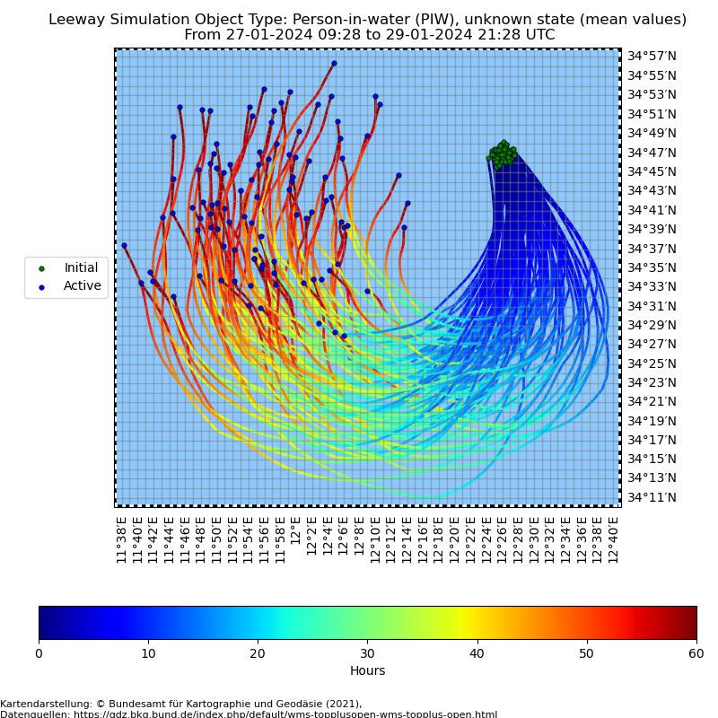

# About
This is a little Django web application that does an [OpenDrift](https://github.com/OpenDrift/opendrift) [Leeway](https://opendrift.github.io/choosing_a_model.html) simulation with a set of provided parameters via a web formular. The result is sent to a user via e-mail.

This is an experimental tool to help Search and Rescue operations. An experimental service is available at [leeway.tuerantuer.org](https://leeway.tuerantuer.org).

Sample output from the leeway tool (100 points, 1km radius, south of Lampedusa):



# Install
1. Clone this repository and `cd` into the new directory
1. Create an virtual environment and activate it:
   ```bash
   python3 -m venv .venv
   source .venv/bin/activate
   ```
1. Install the dependencies:
   ```bash
   pipenv install
   ```
1. Initialize the database:
   ```bash
   cd django_leeway
   python3 manage.py migrate
   python3 manage.py createsuperuser
   ```

# Development Mode
1. Switch into the cloned project and then into the `django_leeway` subdirectory.
1. Open two terminals.
1. In the first terminal run:
   ```bash
   source ../.venv/bin/activate
   python3 manage.py runserver
   ```
1. In the second terminal run:
   ```bash
   source ../.venv/bin/activate
   celery -A leeway worker -l INFO
   ```

# Production Mode
This details the installation on Debian with Apache2 and mod_wsgi.

1. Clone to `/opt/leeway`
1. Create the virtual environment as detailed in the Install chapter.
1. Use `python3 setup.py develop` to install the application into the virtual environment.
1. Install Docker and add the `docker` group to the `www-data` user.
1. Configure Apache2 according to example.
1. Set up Celery worker with `leeway-celery.service` and start the service.
